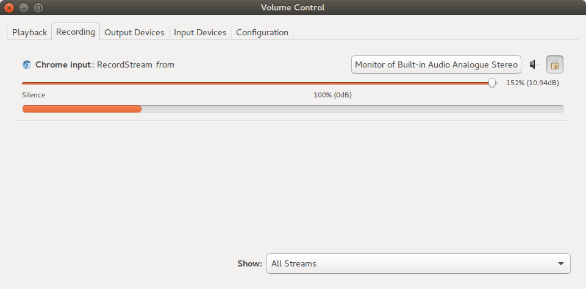

# Getting Started

:::warning
These are the docs for modV 3.
If you are looking for modV 2, please switch version in the top right.
:::

The latest modV version is on modV's GitHub Repo under "Releases". [https://github.com/vcync/modV/releases/latest](https://github.com/vcync/modV/releases/latest)

## System Requirements
### Minimum
* Mac, Windows or Linux (with desktop shell)

### Recommended
* NVIDIA or ATI graphics card
* Intel i5 or better
* 4GB+ RAM

## GPU Settings

### Windows
Windows laptops may have dual GPUs, one on the processor, the other dedicated.
Either Windows or the GPU's software determine which GPU certain programs will operate on.

modV needs to run on the most powerful GPU, in most cases the dedicated GPU.

#### NVIDIA
1. Open the `NVIDIA Control Panel`
2. Select `3D Settings > Manage 3D settings`
    1. *In the Program Settings:* select `modV`
    2. *Under Preferred Graphics Processor:* select `High Performance NVIDIA processor`
    3. *In Specify settings for this program:* ensure these options:
        * Power Mangement Mode: `Prefer Maximum Performance`
        * (optional) Vertical Sync: `off`
3. (optional) Select `Display > Adjust desktop size and position`
    1. Set `Perform Scaling on` to `GPU` for every screen attached to your computer
    2. If it's not possible to save this setting, change the `scaling mode` to `no scaling`

### macOS
macOS will automatically enable the dedicated GPU, if present.

### Linux

#### NVIDIA
NVIDIA Optimus users will need to make sure the system is running on the dedicated GPU.
If you are using "switchable graphics", make sure the system knows to switch when modV is running.
Otherwise, use NVIDIA graphics over Intel.

## Audio Routing
To use modV as an audio visualiser you will need an audio source.

Commonly available audio sources include:

1. If your computer has a microphone built-in, you can use that
2. Use an audio source via a line-in jack
3. Route audio using software routing. See below for OS specific set-up

### Windows
We recommend VB Cable to route audio to the browser, download that [here](http://vb-audio.pagesperso-orange.fr/Cable/).

#### Configuring VB Cable

* Set the system audio to route through VB Cable:
  * 1. Open the Sound Control Panel (`win + r` `control.exe /name Microsoft.Sound`)
    2. *In the Playback tab:* Set `CABLE Input` as the Default Device
* Listening to VB CABLE's output:
  * 1. _In the Recording tab:_ Right click `CABLE Output` and select `Properties`
    2. *In the Listen tab:* Check `Listen to the device` and select the Playback device to your speakers or headphones in the dropdown menu

### macOS
Soundflower is open source and a free application which can route audio to the browser, download that [here](https://github.com/mattingalls/Soundflower/releases/).

* Set the system audio to route through SoundFlower:
  * 1. Open "Audio MIDI Setup" in `/Applications/Utilities/`
    2. Create a new "Multi-Output Device" with the `+` button in the bottom left
    3. Add "Soundflower 2ch" and any other device you'd like audio to output to (such as "Built-in Output" to listen to the audio)
    4. Select your new Multi-Output Device in "System Preferences > Sound" to be the output

### Linux

#### Pulse Audio

1. Download and install [Pulse Audio's](https://www.freedesktop.org/wiki/Software/PulseAudio/) Volume Control package
2. This [tutorial](https://www.kirsle.net/blog/entry/redirect-audio-out-to-mic-in-linux) shows how to setup the Input Devices to show your monitoring
3. When you start the modV application, your browser should appear as a recording device in the `Recording` tab

