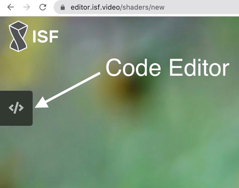

# Writing an ISF Module

We're going to write a Module which works with the built-in `isf` Renderer.

To follow this guide, we'd recommend having some experience with:

- JavaScript (ES6+)
- GLSL
  - if you don't already have experience with GLSL then we recommend [The Book of Shaders](https://thebookofshaders.com/)
- [Interactive Shader Format](https://isf.video/)

## What is ISF?

The **I**nteractive **S**hader **F**ormat is a GLSL format which provides helpful method, common uniforms and also includes a JSON block at the top of the file, defining inputs which can be parsed to create user editable controls.

ISF's JSON block also defines the author, description of the shader and render passes. You can learn more about the Interactive Shader Format specification on their website: [docs.isf.video](https://docs.isf.video/ref_index.html)

## 1. Create a new file

Save a blank JavaScript file in the [Media Manager's media directory](/guide/mediaManager.html#media-folder). This will need to be placed in a `module` folder within a Project folder. e.g. `[media path]/[project]/module`.

By saving your Module here the Media Manager will compile your code and send it to modV on every file save. If you've placed your Module within a Group already, you'll need to remove it from the Group and drag your Module in again from the Gallery to use the updated Module.

## 2. Export an Object

Let's get started by exporting an Object. modV Modules are written out as a plain Object.

```JavaScript
export default {

};
```

## 3. Set up the Meta

Next up, we'll need to describe our Module with a meta Object block.
Let's define the Module type as `isf` and give our Module a `name` + `author`.

```JavaScript
export default {
  meta: {
    // this tells modV our Module should be used with the isf renderer
    type: 'isf',
    name: 'Name of the Module',
    author: 'Name of the Author'
  },
};
```

## 4. Parametrize & debug your shader using the ISF web editor

If you already have a shader that you want to transform into ISF, it makes the most sense to use the official [ISF web editor](https://editor.isf.video/shaders/new).

When you create a new project there, you will see the following default code in the code editor (click on the icon to open it).



1. The first section, which is commented out with `/* */` is the ISF JSON block (configuration) with some meta data about the shader, the properties and render passes.
2. The second part is the code of the shader

You can remove everything and use this as a starting point for your shader as it already defines some defaults and explains the difference to shadertoy for time and resolution. The [interactive demo can also be found](https://editor.isf.video/shaders/5fd9d15fd4849b0013135c0e) to play with.

```JavaScript
/*{
	"DESCRIPTION": "",
	"CREDIT": "",
	"ISFVSN": "2",
	"CATEGORIES": [
		"XXX"
	],
	"INPUTS": [
		{
			"NAME": "alpha",
			"TYPE": "float",
			"DEFAULT": 0.5,
			"MIN": 0.0,
			"MAX": 1.0
		}
	]
}*/

// We can't use
// void mainImage( out vec4 fragColor, in vec2 fragCoord )
// as we would do in shadertoy, but use main() instead
void main()	{
  // ISF is using RENDERSIZE instead of iResolution
  vec2 uv = gl_FragCoord.xy/RENDERSIZE.xy;

  // ISF is using TIME instead of iTime
  float iTime = TIME;

  // The following line is the default code for a shader
  // created in shadertoy
  vec3 col = 0.5 + 0.5*cos(iTime+uv.xyx+vec3(0,2,4));

	gl_FragColor = vec4(col, alpha);
}
```

If there are any errors the ISF editor will show them to you, which improves debugging a lot. If you still have problems to convert your shader into ISF, you can look into [Converting Non-ISF GLSL Shaders to ISF](https://docs.isf.video/quickstart.html#converting-non-isf-glsl-shaders-to-isf) as this covers other differences in the code. And you might want to look at the [ISF Specification](https://github.com/mrRay/ISF_Spec/).


## 5. Define your shader

In `isf` type Modules, there are two properties on the Module body to define the Shaders we want to use:

* `fragmentShader`
* `vertexShader`

The `fragmentShader` is required, but the `vertexShader` is optional. Both variables only accept Strings.

If you have a larger shader or require syntax highlighting, you may import your shaders using:

```JavaScript
import fragmentShader from 'gradient.frag';
import vertexShader from 'gradient.vert';
```

We'll only be using the `fragmentShader` property in this guide:

```JavaScript
export default {
  // meta: { ... },

  fragmentShader: `
    /*{
      "DESCRIPTION": "Get started with ISF using the default shadertoy shader",
      "CREDIT": "shadertoy",
      "ISFVSN": "2",
      "CATEGORIES": [
        "gradient"
      ],
      "INPUTS": [
        {
          "NAME": "alpha",
          "TYPE": "float",
          "DEFAULT": 0.5,
          "MIN": 0.0,
          "MAX": 1.0
        }
      ]
    }*/

    // We can't use
    // void mainImage( out vec4 fragColor, in vec2 fragCoord )
    // as we would do in shadertoy, but use main() instead
    void main()	{
      // ISF is using RENDERSIZE instead of iResolution
      vec2 uv = gl_FragCoord.xy/RENDERSIZE.xy;

      // ISF is using TIME instead of iTime
      float iTime = TIME;

      // The following line is the default code for a shader
      // created in shadertoy
      vec3 col = 0.5 + 0.5*cos(iTime+uv.xyx+vec3(0,2,4));

      gl_FragColor = vec4(col, alpha);
    }
  `,
};
```

## 6. Properties

`isf` Modules' properties are primarily auto-generated from the JSON block at the top of the file. However, if custom controls are required, props may be defined with the same uniform name as in the shader.

## 7. Putting everything together

The following code puts together everything from above:

```JavaScript
export default {
  meta: {
    type: 'isf',
    name: 'Get started with ISF using the default shadertoy shader',
    author: 'NERDDISCO'
  },

  fragmentShader: `
    /*{
      "DESCRIPTION": "Get started with ISF using the default shadertoy shader",
      "CREDIT": "shadertoy for the code & NERDDISCO for converting it to ISF",
      "ISFVSN": "2",
      "CATEGORIES": [
        "gradient"
      ],
      "INPUTS": [
        {
          "NAME": "alpha",
          "TYPE": "float",
          "DEFAULT": 0.5,
          "MIN": 0.0,
          "MAX": 1.0
        }
      ]
    }*/

    // We can't use
    // void mainImage( out vec4 fragColor, in vec2 fragCoord )
    // as we would do in shadertoy, but use main() instead
    void main()	{
      // ISF is using RENDERSIZE instead of iResolution
      vec2 uv = gl_FragCoord.xy/RENDERSIZE.xy;

      // ISF is using TIME instead of iTime
      float iTime = TIME;

      // The following line is the default code for a shader
      // created in shadertoy
      vec3 col = 0.5 + 0.5*cos(iTime+uv.xyx+vec3(0,2,4));

      gl_FragColor = vec4(col, alpha);
    }
  `,
};
```

